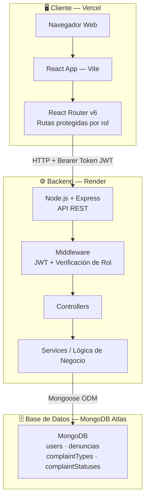
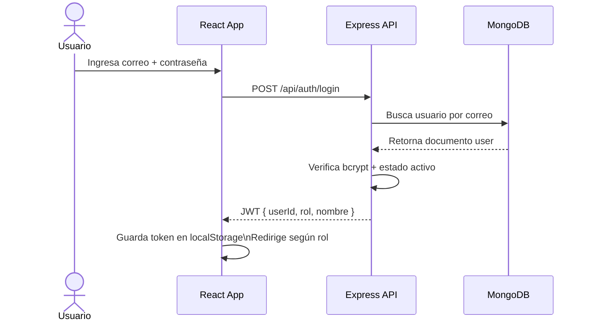
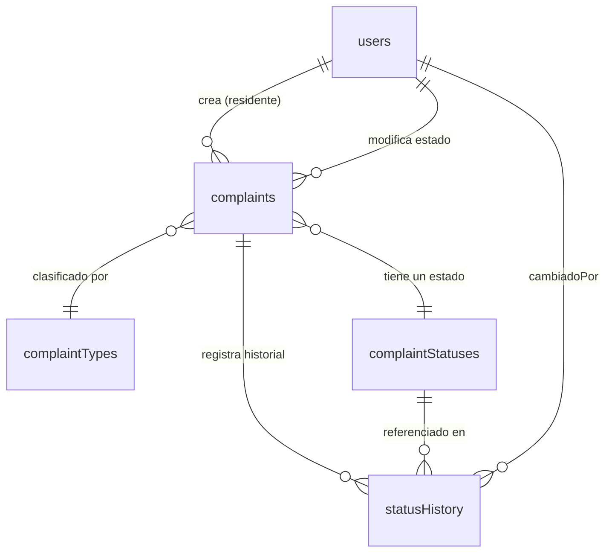

# Diseño Técnico — Sistema de Denuncias v1
## Paso 1: Arquitectura de Alto Nivel

**Fecha:** 18 de marzo de 2026  
**Arquitecto:** Perplexity AI  
**Estado:** Aprobado para v1 (una unidad residencial)

---

### Diagrama General del Sistema




---

### Flujo de Autenticación




---

### Decisiones Arquitectónicas Clave

| Decisión | Elección | Por qué |
| :-- | :-- | :-- |
| Patrón backend | MVC (Routes → Controllers → Services → Models) | Separa responsabilidades sin sobrecomplicar |
| Estado auth frontend | Context API + `useReducer` | Redux es sobreingeniería para 3 roles |
| Validación forms | React Hook Form + Zod | Integración nativa con shadcn/ui, tipado limpio |
| HTTP client | Axios con interceptor de token | Adjunta JWT automáticamente en cada request |
| Borrado de registros | Soft delete (`isActive: false`) | El SRS lo exige explícitamente para denuncias y usuarios |
| Almacenamiento JWT | `localStorage` | Suficiente para contexto académico; httpOnly cookie agrega complejidad de CORS sin beneficio real aquí |


---

### Estructura de Carpetas — Monorepo (Único Repo)

```
monorepo-denuncias/
├── frontend/
│ ├── src/
│ │ ├── api/ # Axios: authApi, usersApi, complaintsApi, catalogApi
│ │ ├── components/
│ │ │ ├── ui/ # Componentes shadcn (generados automáticamente)
│ │ │ └── shared/ # Navbar, Modal, Badge, Spinner, ConfirmDialog
│ │ ├── context/ # AuthContext.jsx (token, user, rol, logout)
│ │ ├── hooks/ # useAuth.js, useDebounce.js
│ │ ├── pages/
│ │ │ ├── auth/ # LoginPage.jsx
│ │ │ ├── resident/ # MyComplaintsPage, CreateComplaintPage, ProfilePage
│ │ │ └── admin/ # ComplaintsPage, UsersPage, CatalogsPage, AdminsPage
│ │ ├── routes/ # PrivateRoute.jsx, RoleRoute.jsx
│ │ ├── utils/ # constants.js (prioridades, roles), formatDate.js
│ │ ├── App.jsx
│ │ └── main.jsx
│ ├── tailwind.config.js # Paleta del cliente ya definida
│ ├── package.json
│ ├── vite.config.js
│ └── index.html
│
├── backend/
│ ├── src/
│ │ ├── config/ # db.js (conexión Mongoose), env.js
│ │ ├── controllers/ # authController, userController,
│ │ │ # complaintController, catalogController
│ │ ├── middlewares/ # verifyToken.js, verifyRole.js, errorHandler.js
│ │ ├── models/ # User.js, Complaint.js,
│ │ │ # ComplaintType.js, ComplaintStatus.js
│ │ ├── routes/ # authRoutes, userRoutes,
│ │ │ # complaintRoutes, catalogRoutes
│ │ └── app.js
│ ├── scripts/
│ │ └── seed.js # Crea el Super Admin inicial
│ ├── .env.example
│ ├── package.json
│ └── server.js
│
├── docs/
│ └── DESIGN.md # Este archivo consolidado
│
├── package.json # Root: "dev", "build", "seed"
├── docker-compose.yml # MongoDB local + backend (opcional)
├── .gitignore
└── README.md # Setup completo + despliegue
```
## Paso 2: Modelo de Datos MongoDB

**Colecciones:** `users` · `complaints` · `complaintTypes` · `complaintStatuses`

---

### Colección: `users`

| Campo | Tipo | Obligatorio | Restricciones |
|---|---|---|---|
| `_id` | ObjectId | Auto | Generado por MongoDB |
| `nombre` | String | ✅ | Trim |
| `correo` | String | ✅ | Único en el sistema, lowercase |
| `password` | String | ✅ | Nunca se retorna en responses |
| `rol` | String | ✅ | Valores: `superadmin` / `admin` / `resident` |
| `isActive` | Boolean | ✅ | Default: `true` |
| `telefono` | String | ❌ | Opcional para todos los roles |
| `torre` | String | Condicional | Obligatorio solo si `rol === resident` |
| `apartamento` | String | Condicional | Obligatorio solo si `rol === resident` |
| `tipoResidente` | String | ❌ | Valores: `propietario` / `arrendatario`. Solo aplica a residents |
| `createdAt` | Date | Auto | Generado automáticamente |
| `updatedAt` | Date | Auto | Generado automáticamente |

**Reglas de negocio:**
- `correo` debe ser único en todo el sistema (RF-08)
- SuperAdmin solo se crea vía `seed.js`, nunca por endpoint (RF-05)
- Usuarios con `isActive: false` no pueden iniciar sesión bajo ninguna circunstancia (RF-03)
- Un SuperAdmin no puede desactivar su propia cuenta (RF-11)
- Solo SuperAdmin puede cambiar `password` de cualquier usuario (RF-38)
- Si se pierden las credenciales del SuperAdmin, existe un script de reset 
  documentado en el README (EC-02)
- Un cambio de contraseña no invalida sesiones JWT activas; 
  el token sigue válido hasta su expiración natural de 24h (EC-13)

---

### Colección: `complaintTypes`

| Campo | Tipo | Obligatorio | Restricciones |
|---|---|---|---|
| `_id` | ObjectId | Auto | Generado por MongoDB |
| `nombre` | String | ✅ | Trim |
| `descripcion` | String | ❌ | Breve, puede estar vacía |
| `isActive` | Boolean | ✅ | Default: `true` |
| `createdAt` | Date | Auto | Generado automáticamente |
| `updatedAt` | Date | Auto | Generado automáticamente |

**Valores iniciales (seed):**
`Seguridad` · `Aseo` · `Ruido` · `Zonas Comunes` · `Infraestructura`

**Reglas de negocio:**
- Borrado físico permitido **solo si nunca fue referenciado** en ninguna complaint (RF-15)
- Si fue referenciado: únicamente `isActive: false` (RF-15)
- Antes de desactivar, mostrar advertencia con conteo de complaints que lo usan (RF-16)
- Complaints existentes mantienen la referencia aunque el tipo se desactive (RF-17)
- Solo tipos con `isActive: true` aparecen en el formulario de nueva denuncia (RF-21)

---

### Colección: `complaintStatuses`

| Campo | Tipo | Obligatorio | Restricciones |
|---|---|---|---|
| `_id` | ObjectId | Auto | Generado por MongoDB |
| `nombre` | String | ✅ | Trim |
| `isActive` | Boolean | ✅ | Default: `true` |
| `isDefault` | Boolean | ✅ | Default: `false`. Marca los 4 estados mínimos del sistema |
| `createdAt` | Date | Auto | Generado automáticamente |
| `updatedAt` | Date | Auto | Generado automáticamente |

**Valores iniciales obligatorios (seed):**

| Nombre | isDefault |
|---|---|
| `Registrada` | `true` |
| `En proceso` | `true` |
| `Resuelta` | `true` |
| `Rechazada` | `true` |

**Reglas de negocio:**
- Estados con `isDefault: true` **nunca pueden borrarse físicamente** (RF-19)
- Estados con `isDefault: true` sí pueden desactivarse, pero con advertencia previa (RF-20)
- Solo estados con `isActive: true` aparecen en el selector de cambio de estado (RF-21)

---

### Colección: `complaints`

| Campo | Tipo | Obligatorio | Restricciones |
|---|---|---|---|
| `_id` | ObjectId | Auto | Generado por MongoDB |
| `titulo` | String | ✅ | Trim |
| `descripcion` | String | ✅ | — |
| `ubicacion` | String | ✅ | Texto libre. Ej: `Torre 3, Apto 402` (RF-27) |
| `tipo` | ObjectId → `complaintTypes` | ✅ | Referencia se mantiene aunque el tipo se desactive |
| `estado` | ObjectId → `complaintStatuses` | ✅ | Default al crear: ObjectId de `Registrada` |
| `residente` | ObjectId → `users` | ✅ | Usuario que creó la denuncia |
| `prioridad` | String | ✅ | Valores: `sin_asignar` / `baja` / `media` / `alta`. Default: `sin_asignar` |
| `statusHistory` | Array de subdocumentos | ✅ | Se puebla automáticamente en cada cambio de estado |
| `createdAt` | Date | Auto | Generado automáticamente |
| `updatedAt` | Date | Auto | Generado automáticamente |

**Subdocumento: `statusHistory[]`**

| Campo | Tipo | Obligatorio | Descripción |
|---|---|---|---|
| `estadoAnterior` | ObjectId → `complaintStatuses` | ❌ | `null` en la creación inicial |
| `estadoNuevo` | ObjectId → `complaintStatuses` | ✅ | Estado al que se cambió |
| `cambiadoPor` | ObjectId → `users` | ✅ | Usuario que realizó el cambio |
| `fecha` | Date | ✅ | Fecha y hora del cambio |

**Reglas de negocio:**
- Complaints **nunca se borran** físicamente del sistema (RF-26)
- Prioridad solo puede ser asignada o modificada por admin / superadmin (RF-30)
- Residente solo puede editar `titulo`, `descripcion`, `tipo` y `ubicacion` si `estado === Registrada` (RF-25)
- Cada cambio de estado genera automáticamente una entrada en `statusHistory` (RF-31)
- Flujo de estados libre: el admin puede cambiar a cualquier estado activo sin restricción de secuencia (RF-29)

---

### Relaciones entre Colecciones



---

### Variables de Entorno (`.env.example`)

| Variable | Descripción | Ejemplo |
|---|---|---|
| `PORT` | Puerto del servidor | `5000` |
| `MONGO_URI` | Cadena de conexión MongoDB Atlas | `mongodb+srv://...` |
| `JWT_SECRET` | Secreto para firmar tokens JWT | Mínimo 32 caracteres |
| `JWT_EXPIRES_IN` | Duración del token (RF-02) | `24h` |
| `BCRYPT_ROUNDS` | Rondas de hashing (RNF-01) | `10` |
| `NODE_ENV` | Entorno de ejecución | `development` / `production` |

---

## Paso 3: Diseño de API REST

**Base URL:** `/api`  
**Autenticación:** Bearer Token JWT en header `Authorization` para todos los endpoints excepto login  
**Convención de respuesta:**
- Éxito: `{ ok: true, data: {...} }`
- Error: `{ ok: false, message: "descripción del error" }`

---

### Módulo 1: Autenticación

| Método | Ruta | Descripción | Acceso |
|---|---|---|---|
| POST | `/auth/login` | Iniciar sesión | Público |

**POST `/auth/login`**
- **Body:** `correo`, `password`
- **Respuesta exitosa:** `{ token, user: { id, nombre, rol } }`
- **Códigos:** `200` éxito · `401` credenciales inválidas · `403` cuenta inactiva

---

### Módulo 2: Gestión de Residentes

| Método | Ruta | Descripción | Acceso |
|---|---|---|---|
| GET | `/residents` | Listar todos los residentes | Admin / SuperAdmin |
| POST | `/residents` | Crear residente | Admin / SuperAdmin |
| GET | `/residents/:id` | Ver detalle de un residente | Admin / SuperAdmin |
| PUT | `/residents/:id` | Editar datos de un residente | Admin / SuperAdmin |
| PATCH | `/residents/:id/status` | Activar o desactivar residente | Admin / SuperAdmin |

**GET `/residents`**
- **Query params:** `search` (nombre / correo / apartamento) · `isActive`
- **Respuesta:** Array de residentes + `total`
- **Códigos:** `200` éxito · `401` sin token · `403` sin permiso

**POST `/residents`**
- **Body:** `nombre`, `correo`, `password`, `torre`, `apartamento`, `isActive`, `telefono`(opcional), `tipoResidente`(opcional)
- **Códigos:** `201` creado · `400` validación fallida · `409` correo duplicado

**PUT `/residents/:id`**
- **Body:** `nombre`, `correo`, `torre`, `apartamento`, `telefono`, `tipoResidente`, `isActive`. Si `password` viene vacío no se actualiza (RF-39)
- **Códigos:** `200` éxito · `404` no encontrado · `409` correo duplicado

**PATCH `/residents/:id/status`**
- **Body:** `isActive` (Boolean)
- **Códigos:** `200` éxito · `404` no encontrado

---

### Módulo 3: Gestión de Administradores

| Método | Ruta | Descripción | Acceso |
|---|---|---|---|
| GET | `/admins` | Listar todos los admins | SuperAdmin |
| POST | `/admins` | Crear admin o superadmin | Admin (solo admin) / SuperAdmin (admin y superadmin) |
| GET | `/admins/:id` | Ver detalle de un admin | SuperAdmin |
| PUT | `/admins/:id` | Editar datos de un admin | SuperAdmin |
| PATCH | `/admins/:id/status` | Activar o desactivar admin | SuperAdmin |

**POST `/admins`**
- **Body:** `nombre`, `correo`, `password`, `rol` (`admin` / `superadmin`), `telefono`(opcional)
- **Restricción:** Solo SuperAdmin puede crear cuentas de admin 
  y superadmin. Admin regular no tiene acceso a este endpoint → `403` (HU-05)
- **Códigos:** `201` creado · `400` validación · 
  `403` sin permiso · `409` correo duplicado

**PATCH `/admins/:id/status`**
- **Body:** `isActive` (Boolean)
- **Restricción:** SuperAdmin no puede desactivar su propia cuenta → `403` (RF-11)
- **Códigos:** `200` éxito · `403` auto-desactivación bloqueada · `404` no encontrado

---

### Módulo 4: Catálogo — Tipos de Denuncia

| Método | Ruta | Descripción | Acceso |
|---|---|---|---|
| GET | `/complaint-types` | Listar tipos | Admin / SuperAdmin |
| GET | `/complaint-types/active` | Listar solo activos (para formularios) | Resident / Admin / SuperAdmin |
| POST | `/complaint-types` | Crear tipo | Admin / SuperAdmin |
| PUT | `/complaint-types/:id` | Editar tipo | Admin / SuperAdmin |
| PATCH | `/complaint-types/:id/status` | Activar o desactivar | Admin / SuperAdmin |
| DELETE | `/complaint-types/:id` | Borrar físicamente | Admin / SuperAdmin |

**PATCH `/complaint-types/:id/status`**
- **Body:** `isActive` (Boolean)
- **Respuesta incluye:** `complaintsCount` (cuántas complaints lo usan) para mostrar advertencia en frontend (RF-16)
- **Códigos:** `200` éxito · `404` no encontrado

**DELETE `/complaint-types/:id`**
- **Restricción:** Solo permitido si `complaintsCount === 0`. Si fue usado → `409` (RF-15)
- **Códigos:** `200` éxito · `409` tiene complaints asociadas

---

### Módulo 5: Catálogo — Estados de Denuncia

| Método | Ruta | Descripción | Acceso |
|---|---|---|---|
| GET | `/complaint-statuses` | Listar estados | Admin / SuperAdmin |
| GET | `/complaint-statuses/active` | Listar solo activos (para formularios) | Resident / Admin / SuperAdmin |
| POST | `/complaint-statuses` | Crear estado | Admin / SuperAdmin |
| PUT | `/complaint-statuses/:id` | Editar estado | Admin / SuperAdmin |
| PATCH | `/complaint-statuses/:id/status` | Activar o desactivar | Admin / SuperAdmin |
| DELETE | `/complaint-statuses/:id` | Borrar físicamente | Admin / SuperAdmin |

**DELETE `/complaint-statuses/:id`**
- **Restricción:** Bloqueado si `isDefault: true` → `403` (RF-19)
- **Códigos:** `200` éxito · `403` estado por defecto no borrable

---

### Módulo 6: Gestión de Denuncias

| Método | Ruta | Descripción | Acceso |
|---|---|---|---|
| GET | `/complaints` | Listar todas las denuncias | Admin / SuperAdmin |
| GET | `/complaints/mine` | Listar mis denuncias | Resident |
| POST | `/complaints` | Crear denuncia | Resident |
| GET | `/complaints/:id` | Ver detalle de denuncia | Resident (solo suyas) / Admin / SuperAdmin |
| PUT | `/complaints/:id` | Editar denuncia | Resident (solo si estado = Registrada) |
| PATCH | `/complaints/:id/status` | Cambiar estado | Admin / SuperAdmin |
| PATCH | `/complaints/:id/priority` | Cambiar prioridad | Admin / SuperAdmin |

**GET `/complaints`**
- **Query params:** `estado` · `tipo` · `prioridad` · `fechaDesde` · `fechaHasta` · `search`
- **Respuesta:** Array de complaints (populadas: tipo, estado, residente) + `total`
- **Códigos:** `200` éxito · `403` sin permiso

**GET `/complaints/mine`**
- **Query params:** `search` (título / tipo) · `estado` · `prioridad`
- **Respuesta:** Array de complaints del residente autenticado + `total`
- **Códigos:** `200` éxito · `401` sin token

**POST `/complaints`**
- **Body:** `titulo`, `descripcion`, `tipo` (ObjectId), `ubicacion`
- **Backend asigna automáticamente:** `estado = Registrada` · `prioridad = sin_asignar` · `residente = userId del token` · `statusHistory[0]` (RF-23)
- **Códigos:** `201` creado · `400` validación fallida

**PUT `/complaints/:id`**
- **Body:** `titulo`, `descripcion`, `tipo`, `ubicacion`
- **Restricción:** Bloqueado si `estado !== Registrada` → `403` (RF-25)
- **Códigos:** `200` éxito · `403` edición bloqueada por estado

**PATCH `/complaints/:id/status`**
- **Body:** `estadoId` (ObjectId)
- **Backend agrega automáticamente** entrada a `statusHistory` con `cambiadoPor`, `estadoAnterior`, `estadoNuevo`, `fecha` (RF-31)
- **Códigos:** `200` éxito · `400` estado inválido o inactivo

**PATCH `/complaints/:id/priority`**
- **Body:** `prioridad` (`sin_asignar` / `baja` / `media` / `alta`)
- **Códigos:** `200` éxito · `400` valor inválido · `403` sin permiso

---

### Perfil de Usuario

| Método | Ruta | Descripción | Acceso |
|---|---|---|---|
| GET | `/profile` | Ver perfil propio | Todos los roles |

**GET `/profile`**
- **Respuesta:** Datos del usuario autenticado (sin `password`)
- **Códigos:** `200` éxito · `401` sin token

---

### Tabla de Códigos de Estado HTTP

| Código | Significado | Cuándo usarlo |
|---|---|---|
| `200` | OK | Consulta o actualización exitosa |
| `201` | Created | Recurso creado exitosamente |
| `400` | Bad Request | Validación fallida, campo inválido |
| `401` | Unauthorized | Sin token o token inválido/expirado |
| `403` | Forbidden | Token válido pero sin permiso para esa acción |
| `404` | Not Found | Recurso no encontrado |
| `409` | Conflict | Correo duplicado, tipo en uso |
| `500` | Server Error | Error inesperado del servidor |

---

## Paso 4: Estructura de Componentes React

**Librería UI:** shadcn/ui + Tailwind  
**Enrutamiento:** React Router v6  
**Estado global:** Context API + useReducer (solo autenticación)  
**Formularios:** React Hook Form + Zod

---

### Árbol de Rutas

```
/                          → Redirige según rol (o a /login si no autenticado)
/login                     → LoginPage (pública)

/mis-denuncias             → MyComplaintsPage        [resident]
/mis-denuncias/:id         → ComplaintDetailPage      [resident]
/crear-denuncia            → CreateComplaintPage      [resident]
/perfil                    → ProfilePage              [resident]

/denuncias                 → AllComplaintsPage        [admin, superadmin]
/denuncias/:id             → ComplaintDetailAdminPage [admin, superadmin]
/residentes                → ResidentsPage            [admin, superadmin]
/catalogos                 → CatalogsPage             [admin, superadmin]
/administradores           → AdminsPage               [superadmin]
```

---

### Guards de Ruta

| Componente | Responsabilidad |
|---|---|
| `PrivateRoute` | Verifica que exista token válido. Si no → redirige a `/login` |
| `RoleRoute` | Verifica que el rol del usuario tenga permiso para esa ruta. Si no → redirige a su home |

---

### Componentes Compartidos (`components/shared/`)

| Componente | Descripción | RF cubierto |
|---|---|---|
| `Navbar` | Menú lateral o superior. Muestra solo opciones del rol activo. Incluye botón Logout | RF-36 |
| `ConfirmDialog` | Modal reutilizable para acciones destructivas. Props: `title`, `message`, `onConfirm`, `onCancel` | RF-33 |
| `StatusBadge` | Badge de color según estado de denuncia. Usa paleta del cliente | — |
| `PriorityBadge` | Badge de color según prioridad (`sin_asignar`, `baja`, `media`, `alta`) | — |
| `SearchInput` | Input con debounce integrado (300–500ms). Emite valor al padre | RF-32 |
| `LoadingSpinner` | Spinner o Skeleton para operaciones con backend | RF-35 |
| `EmptyState` | Mensaje visual cuando no hay registros en una lista | RF-37 |
| `TotalCount` | Muestra total de registros encontrados junto a buscador o filtros | RF-37 |

---

### Páginas — Rol Resident

#### `LoginPage`
- Formulario: `correo` + `password`
- Al éxito: guarda token en Context + redirige según rol
- Muestra error si credenciales inválidas o cuenta inactiva (RF-02, RF-03)

#### `MyComplaintsPage`
- Lista solo las complaints del residente autenticado (RF-24)
- Componentes: `SearchInput` · `TotalCount` · `LoadingSpinner` · `EmptyState`
- Cada fila muestra: título, tipo, `StatusBadge`, `PriorityBadge`
- Botón "Ver detalle" → `/mis-denuncias/:id`
- Botón "Crear denuncia" → `/crear-denuncia`

#### `CreateComplaintPage`
- Formulario: `titulo`, `descripcion`, `tipo` (Select con solo activos), `ubicacion`
- Validación por campo con React Hook Form + Zod (RF-34)
- Al éxito: redirige a `/mis-denuncias`

#### `ComplaintDetailPage` _(vista residente)_
- Muestra todos los campos de la denuncia (solo lectura)
- Historial de cambios de estado visible (RF-31)
- Botón "Editar" visible **solo si** `estado === Registrada` (RF-25)
- Sin opción de eliminar (RF-26)

#### `ProfilePage`
- Muestra datos del usuario autenticado (solo lectura)
- Sin opción de editar contraseña (RF-38)

---

### Páginas — Rol Admin / SuperAdmin

#### `AllComplaintsPage`
- Lista todas las complaints del sistema (RF-28)
- Filtros: estado · tipo · prioridad · rango de fechas (RF-28) + `SearchInput`
- Botón "Limpiar filtros"
- Componentes: `TotalCount` · `StatusBadge` · `PriorityBadge` · `LoadingSpinner`
- Botón "Ver detalle" → `/denuncias/:id`

#### `ComplaintDetailAdminPage` _(vista admin)_
- Muestra todos los campos de la denuncia
- Select de estado (solo activos) + `ConfirmDialog` antes de cambiar (RF-29, RF-33)
- Select de prioridad sin modal (RF-30)
- Historial de cambios completo (RF-31)

#### `ResidentsPage`
- Lista de residentes con `SearchInput` (nombre / correo / apartamento) y `TotalCount`
- Botón "Crear residente" → abre `ResidentFormModal`
- Por cada residente: botón "Editar" → abre `ResidentFormModal` con datos
- Toggle activo/inactivo → `ConfirmDialog` antes de ejecutar (RF-33)

#### `CatalogsPage`
- Dos secciones en tabs o acordeón: **Tipos de Denuncia** y **Estados de Denuncia**
- Cada sección con tabla, botón "Crear", botón "Editar", toggle activo/inactivo
- Desactivar tipo con complaints activas → `ConfirmDialog` con conteo (RF-16)
- Borrar físicamente → `ConfirmDialog` · bloqueado si tiene complaints asociadas (RF-15)
- Desactivar estado `isDefault` → `ConfirmDialog` con advertencia (RF-20)
- Borrar estado `isDefault` → bloqueado, sin opción visible (RF-19)

#### `AdminsPage` _(solo SuperAdmin)_
- Lista de admins con `SearchInput` y `TotalCount`
- Botón "Crear administrador" → abre `AdminFormModal`
- Por cada admin: botón "Editar" · toggle activo/inactivo → `ConfirmDialog`
- Botón de desactivar oculto para la cuenta propia del SuperAdmin (RF-11)

---

### Modales Reutilizables

| Modal | Usado en | Campos |
|---|---|---|
| `ResidentFormModal` | `ResidentsPage` | nombre, correo, password, torre, apartamento, tipo, teléfono, estado |
| `AdminFormModal` | `AdminsPage` | nombre, correo, password, rol, teléfono |
| `ComplaintTypeFormModal` | `CatalogsPage` | nombre, descripción, estado |
| `ComplaintStatusFormModal` | `CatalogsPage` | nombre, estado |

> Todos los modales reutilizan el mismo `ConfirmDialog` para acciones destructivas internas.

---

### Context: `AuthContext`

| Valor expuesto | Tipo | Descripción |
|---|---|---|
| `user` | Object | `{ id, nombre, rol }` extraído del JWT |
| `token` | String | JWT almacenado en localStorage |
| `isAuthenticated` | Boolean | `true` si hay token válido |
| `login(token)` | Function | Guarda token y decodifica user |
| `logout()` | Function | Limpia token y redirige a `/login` |

---

### Hook: `useDebounce`

- Recibe: `value`, `delay` (ms)
- Retorna: valor retrasado
- Usado en: `SearchInput`, todos los buscadores del sistema (RF-32)

---